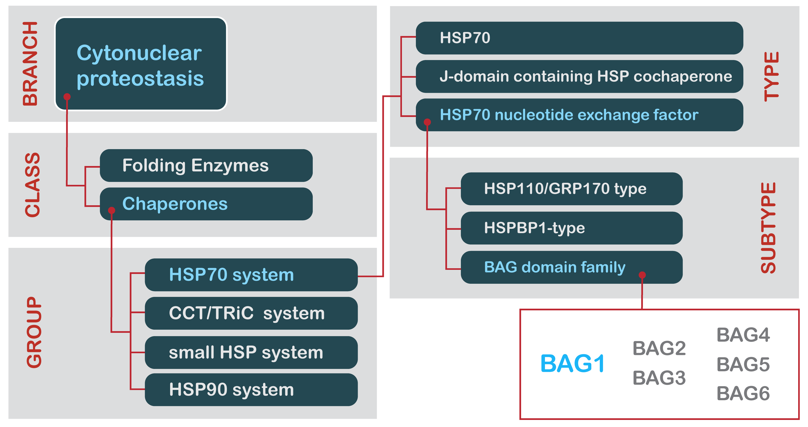

# Protein Interaction Mapper

[](https://www.proteostasisconsortium.com) [](https://github.com/finkbeiner-lab/protein-interaction-mapper/blob/main/LICENSE)

## Overview

New proteins fold into their native structures during or after translation. However, this process is far from perfect, and often fails (Balch et al., 2008; Clark, 2004; Gershenson et al., 2014; Powers et al., 2009), leaving proteins in non-native states that are not functional and potentially toxic— especially if they form aggregates (Balch et al., 2008; Knowles et al., 2014; Powers and Gierasch, 2021; Powers et al., 2009). Because of this, all organisms, beginning with the last universal common ancestor (Powers and Balch, 2013), have a proteostasis network: a collection of cellular components that manage folding, trafficking, and degradation of the members of the proteome (Balch et al., 2008; Jayaraj et al., 2020; Powers and Gierasch, 2021; Powers et al., 2009). The proteostasis network is much discussed in the literature, but remains ill-defined, because there is no consensus of proteostasis network components. Although preliminary efforts with great substance have been made (Brehme et al., 2014; Shemesh et al., 2021), we aim to comprehensively enumerate the human proteostasis network, and make this standardized data accessible via a web-based interface.

We apply two criteria to elucidate proteostasis networks.

1. The “entity-based” criterion: an “entity” (an individual protein or other substance, or a complex) is included as a member of the proteostasis network, if there is specific evidence in the literature of its role in proteostasis.

2. The “domain-based” criterion: an entity is included as a member of the proteostasis network, if it contains a domain or domains very strongly associated to proteostasis— even if there is no evidence yet in literature.

The latter criterion is important for including uncharacterized proteins, some of which are clearly members of structural families with roles in proteostasis. For example, HSPA12A and HSPA12B have not, to our knowledge, been shown to have chaperone activity; yet sequence homology indicates they are members of the HSP70 chaperone family. Thus, such proteins are included in the proteostasis network.

Our database so far contains proteostatic components responsible for protein folding (chaperones and folding enzymes), protein trafficking into and out of organelles, and protein synthesis. The autophagy-lysosome pathway and ubiquitin-proteasome system will be added in the near future.

We developed a taxonomic schema to methodize our enumeration of proteostasis networks, which is illustrated below. This taxonomy consists of five levels: *Branch*, *Class*, *Group*, *Type*, and *Subtype*.



The broadest category, *Branch*, refers to a component’s localization or its membership in an overarching pathway. There are only a handful of *Branch* categories:

- cytonuclear proteostasis
- endoplasmic reticulum proteostasis
- mitochondrial proteostasis
- nuclear proteostasis
- cytosolic translation
- autophagy-lysosome pathway
- ubiquitin-proteasome system

Note that “cytonuclear” components can, in principle, function in either the cytosol or the nucleus, while “nuclear” components function primarily within the nucleus (e.g., histone chaperones). Also, as noted above, the autophagy-lysosome pathway and ubiquitin-proteasome system will be added in future updates.

*Class* generally refers to a component’s function in proteostasis (e.g., chaperones, protein transport, etc.).

While *Group*, *Type*, and *Subtype* become increasingly specific descriptors of proteostasis functions, we only use as many descriptors as necessary to describe a proteostasis network component. Thus, not every component has *Type* or *Subtype* annotations. Also, many components have multiple roles in the proteostasis network. These are given multiple entries to reflect each distinct function.

This enumeration method is a work-in-progress, and will be updated as new information becomes available. We are hopeful that website visitors will lend feedback, especially on our approach towards compiling a list of proteostasis network components. Please start a GitHub Discussion, or email [Evan Powers](https://www.proteostasisconsortium.com/people/#:~:text=VIEW%20LAB-,Evan%20Powers%2C%20PhD,-Institute%20Investigator%0ADepartment) at [epowers@scripps.edu](mailto:epowers@scripps.edu), with any suggestions.

## Developing

1. Install [Node.js >=16](https://nodejs.org/en/download/)
2. Change to this repo directory in your IDE, code editor or CLI and run

    ```bash
    npm install && npm run dev
    ```

    [svelte-headless-table must be manually cloned & linked, from outside this repo](https://github.com/bryanmylee/svelte-headless-table/issues/29)

    ```bash
    npm install && npm run package
    cd {protein-interaction-mapper} && npm link {package directory}
    ```

3. Open a pull request to merge into the `develop` branch with your contribution. We will review it & provide feedback shortly!

## Building

To create a production version:

```bash
npm run build
```

You can preview the production build with `npm run preview`.

> To deploy, you may need to install an [adapter](https://kit.svelte.dev/docs/adapters) for the target environment.

Deployments are automatically updated upon committing to `main`.
